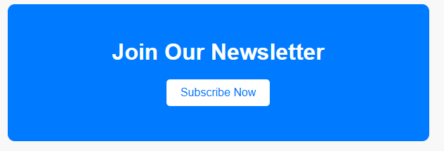

# CTA Banner Exercise

Follow the instructions below to implement the HTML and CSS styles to complete the call to action banner exercise.

The purpose of this exercise is to help you understand how to style buttons with CSS.

The HTML for this exercise is already written out for you, but we will be changing the CSS to re-style the button.

When completing the below instructions, try to save `index.html` after you complete each instructions and inspect the results. This will give you a better idea of what each element and style does.

## Expected Outcome

Normal:


Hover:


## Exercise Instructions

1.  Open up `index.html` with Live Server or Preview. Check out how the button works. Hover over the button, and see if anything changes. Over this exercise, we'll be changing the CSS of this button to make it better fit the theme of the banner behind it.

2.  Open up `styles.css`, and inspect the styles we currently have. Notice how there are no styles that target `button` elements. Let's fix that!

3.  Create a rule set with a descendant selector for all `button` elements inside of `cta-banner` classes.
    <details>
    <summary>solution</summary>

    ```css
    .cta-banner button {
    }
    ```

      </details>

4.  Inside your new rule set, we will do the following:

    -   Remove the border. The default border is ugly and we typically don't need one.
           <details>
           <summary>solution</summary>

        ```css
        border: none;
        ```

           </details>

    -   Increase the size of the button by 10px on the top and bottom, and 20px on the left and right.

        (Hint: This can be done by increasing the padding)
           <details>
           <summary>solution</summary>

        ```css
        padding: 10px 20px;
        ```

           </details>

    -   Increase the font size to 16px to make it easier to read.
           <details>
           <summary>solution</summary>

        ```css
        font-size: 16px;
        ```

           </details>

    -   Set the text color to #007bff (the color of the background) and set the background color of the button to white.

           <details>
           <summary>solution</summary>

        ```css
        color: #007bff;
        background-color: white;
        ```

           </details>

    -   To round the corners, give the button a border radius of 5px.

           <details>
           <summary>solution</summary>

        ```css
        border-radius: 5px;
        ```

           </details>

    -   Finally, when we hover over the button, we want to change the cursor the a pointer instead of the default arrow.

           <details>
           <summary>solution</summary>

        ```css
        cursor: pointer;
        ```

           </details>

5.  Save your file, and inspect the button. It's looking good! But there's one thing missing: Nothing happens when you hover!

6.  To fix this, we need to create one more selector: a pseudo-class selector that selects the button when we hover over it. Create a pseudo-class selector for butto that are descendants of the class `.cta-banner` when we hover over them.

      <details>
         <summary>solution</summary>

    ```css
    .cta-banner button:hover {
    }
    ```

      </details>

7.  Then, when we hover over the button, we want to change 2 things: Change the text color to white, and change the background color to #0056b3.

      <details>
         <summary>solution</summary>

    ```css
    color: white;
    background-color: #0056b3;
    ```

      </details>

8.  And that's it! Save your file, and revisit the button to see if your hover pseudo-class worked!
