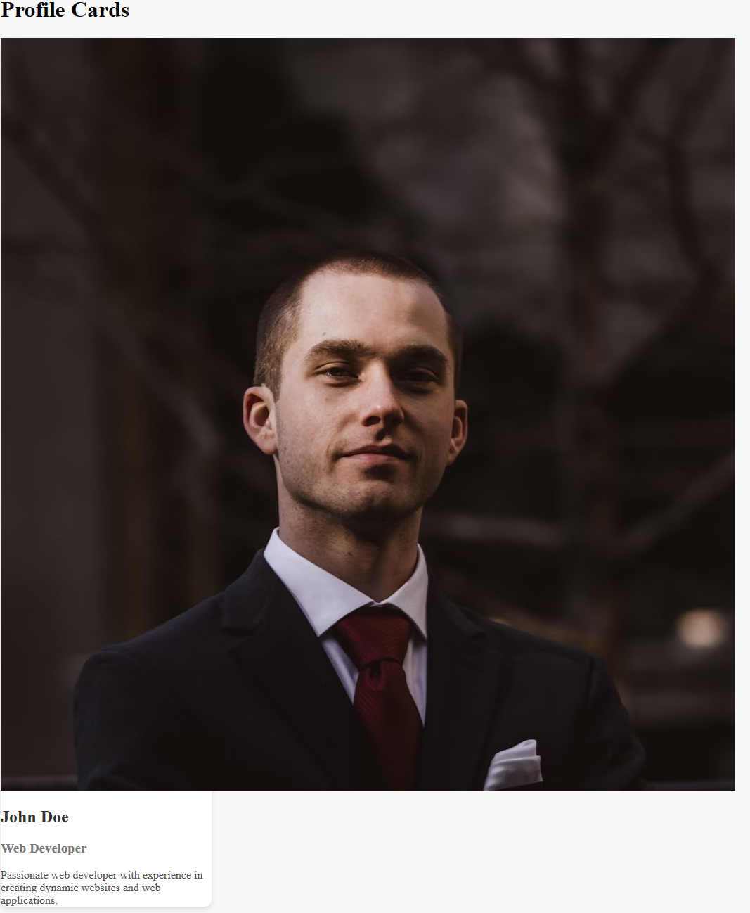
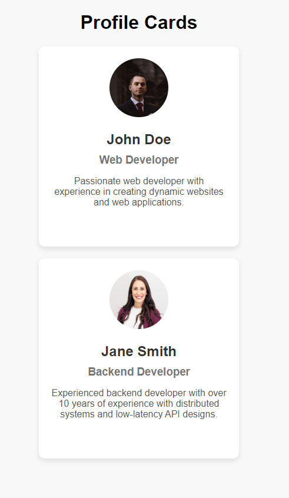

# Profile Card Exercise

Follow the instructions below to implement the HTML and CSS styles to complete the profile card exercise.

There is already some basic HTML and CSS set up for you already.

When completing the below instructions, try to save `index.html` after you complete each instructions and inspect the results. This will give you a better idea of what each element and style does.

## Expected Outcome

## Exercise Instructions

1. Open up `index.html` with Live Server or Preview

2. Create a `
` element under the `<h1>` and provide it with a `class` attribute of `profile-card`.

3. Provide the following elements inside the `
`:

    - an image that has a `src` attribute that points to the file `./images/profilepic1.png`. Provide it with an appropriate `alt` attribute.

    - an `<h2>` with the text "John Doe"

    - an `<h3>` with the text "Web Developer"

    - a paragraph element with the text "Passionate web developer with experience in creating dynamic websites and web applications."

4. Save `index.html`, and inspect the results. It should look something like this:

<b>Screenshot</b>

 

5. Onto the CSS! Open up `styles.css`, and inspect the current styles we have.

6. The first thing we're going to add this time is create a new descendant selector for `img` tags inside of `profile-card` classes. In this rule set, provide the following properties (save them one by one to see what they do):

-   set the width and height to 100px.

-   set the border radius to 50%.

    You should see the profile image become a much smaller circle compared to the full-sized image.

7. Now, center the `h1` by creating a new rule set, and set the font for the entire page to `Arial, sans-serif`.

Hint

For centering the &lt;h1&gt; element, create a new rule set with a tag selector. Then, set the "text-align" property.

For setting the font, go into the `body` selector, and set the `font-family` property.

 

8. Now, inside the existing `profile-card` class selector, center the profile card as well as the text it contains. Make sure to set the top and bottom margins to 20px as well!

    (Hint: use the properties: `margin` and `text-align`)

    Save `index.html` and inspect your results.

9. Notice how there is very little space between the border of our `profile-card` and it's contents. Use the correct property to increase this space to `20px` all around.

    Save `index.html` and inspect the result. It should now look very similar to the "Expected Results" above.

Hint

It is the "padding" property, not "margin".

 

10. Now, create a second profile card with the following information:

    -   An image that's contained in "./images/profilepic2.png"
    -   The name "Jane Smith"
    -   The title "Backend Developer"
    -   The description: "Experienced backend developer with over 10 years of experience with distributed systems and low-latency API designs."

11. Save `index.html`, and it should now look like this:

    Hint: If your profile cards don't have any space between them, review what you did for Step 7!.

<b>Screenshot</b>

