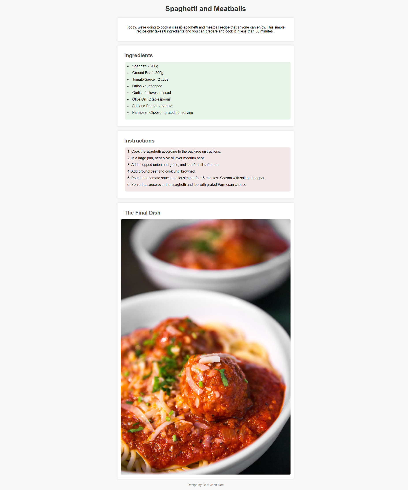

# Recipe Page Exercise

For this exercise, I'm going to provide more vague instructions. The goal is to have you complete as much of this on your own as you can.

I'll still leave steps and hints, but when you do get to things you can't quite figure out, I want you to try to Google things first before asking for help.

This is how your process is going to be once you try these things on your own, so I'll act as support for when you can't quickly find an answer online!

## End Result

## Instructions

1.  Open up `index.html` and `styles.css` in your Code Editor, and open up `index.html` with Live Server or preview. Inspect the pre-filled elements and styles before continuing.

2.  First, fill out `index.html` with the necessary elements. Use `<section>` semantic elements just like with the description, and provide reasonable id values to the different sections.

    Image url: "https://images.unsplash.com/photo-1515516969-d4008cc6241a?q=80&w=1287&auto=format&fit=crop&ixlib=rb-4.0.3&ixid=M3wxMjA3fDB8MHxwaG90by1wYWdlfHx8fGVufDB8fHx8fA%3D%3D"

    

    
HINT: Detailed Instructions

    -   A section with id "ingredients" that contains a subheading "Ingredients" and a bulleted list with all the ingredients in the picture above.

    -   A section with id "instructions" that contains a subheading "Instructions" and a numbered list with all the instructions in the picture above.

    -   A section with id "image" that contains a subheading "The Final Dish" which contains an image element
    

     

    Once you've added all the elements, the website you see will still look very different than the "End Result" you see above. This is normal, and it's time to move on to CSS!

3.  Give the image round corners like we've been doing and set the image's width to no more than it's parent container.

    

    
Hint: Detailed Instructions

    -   Create a selector for `img` tags.

    -   Set `max-width` to `100%`

    -   set `border-radius` to 5px

    

     

4.  Center the paragraph elements inside the description section and increase the space between the text and elements **_around_** it by 20 pixels.

    

    
Hint: Detailed Instructions

    -   Create a descendant selector for paragraph elements inside "description" id elements

    -   Set the `text-align` to `center`

    -   set `margin` to 20px

    

     

5.  Set the color of all `<h2>` elements to #555 and increase the space between `<h2>` elements and the elements **_around_** it by 16 pixels.

    

    
Hint: Detailed Instructions

    -   Create a selector for `h2` tags

    -   Set the `color` to #555

    -   Set the `margin` to 16px;

    

     

6.  Increase the space between `<li>` elements and elements **_under_** it by 12 pixels.

    

    
Hint: Detailed Instructions

    -   Create a selector rule set for `li` tags

    -   Set the `margin-bottom` to 12px

    

     

7.  Increase the space between both `<ul>` and `<ol>` elements and elements **_left of_** of it by 20 pixels.

    

    
Hint: Detailed Instructions

    -   Create a selector rule set for: `ul, ol`

    -   Set the `margin-left` to 20px

    

     

8.  For `<ul>` elements inside the ingredients section, do the following:

    -   set the background color to #e7f3e7

    -   round the corners

    -   Increase the space between it and the border around it by 10 pixels.

    -   Move the bullet points to the inside of the background

    

    
Hint: Detailed Instructions

    -   Create a descendant selector for `ul` tags inside the "ingredients" id

    -   Set the `background-color` to #e7f3e7

    -   Set the `border-radius` to 5px;

    -   Set the `padding` to 10px;

    -   Set the `list-style-position` to `inside`;

    

     

9.  Do the same 4 things to `<ol>` elements inside the instructions section, except set the background color to #f3e7e7

    

    
Hint: Detailed Instructions

    -   Create a descendant selector for `ol` tags inside the "instructions" id

    -   Set the `background-color` to #f3e7e7

    -   Set the `border-radius` to 5px;

    -   Set the `padding` to 10px;

    -   Set the `list-style-position` to `inside`;

    

     

10. Celebrate! You've completed your first website layout!
